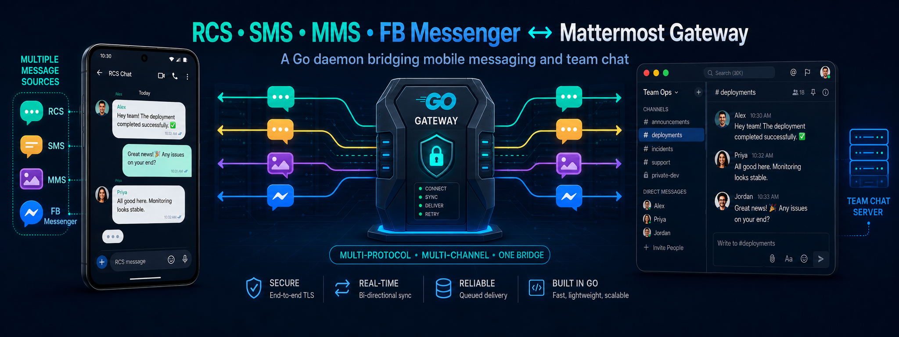

<p align="center">
  
</p>

# msggw

**SMS, MMS and RCS to Mattermost gateway — more messaging platforms planned.**

`msggw` is a small self-hosted Go daemon (`msg-gw`) that surfaces SMS, MMS and — most
importantly — **RCS** conversations from an Android phone inside a Mattermost server, and lets
you reply to them straight from Mattermost. It started life as `rcs_gateway`, focused purely on
RCS; the project has since been renamed because the goal is broader: one gateway bridging
several messaging platforms into Mattermost, with Facebook Messenger planned as a future
addition.

```text
Android phone / Google Messages          Facebook Messenger (planned)
            ⇅                                        ⇅
      SMS / MMS / RCS                                 ⇅
            ⇅                                         ⇅
                       msggw bridge daemon
                              ⇅
                          Mattermost
```

---

## Table of contents

- [Status](#status)
- [Building](#building)
- [Using it](#using-it)
- [Configuration](#configuration)
- [Proposed solution](#proposed-solution)
  - [Objective](#objective)
  - [Why not an SMS gateway](#why-not-an-sms-gateway)
  - [Selected approach: the Google Messages web protocol](#selected-approach-the-google-messages-web-protocol)
  - [Architecture](#architecture)
  - [Mattermost integration](#mattermost-integration)
  - [Conversation model](#conversation-model)
  - [Message flows](#message-flows)
  - [Media and attachments](#media-and-attachments)
  - [Project layout](#project-layout)
  - [Persistent state](#persistent-state)
  - [Pairing and authentication](#pairing-and-authentication)
  - [Deployment](#deployment)
  - [Risks and caveats](#risks-and-caveats)
  - [MVP phases](#mvp-phases)
  - [First milestone](#first-milestone)
- [Documentation](#documentation)
- [License](#license)
- [Author](#author)

---

## Status

**Written, not yet run against a real phone.**

The daemon is implemented end to end — pairing, session persistence, inbound messages,
outbound replies, media both ways, delivery state, storage mappings and deduplication. It
builds statically (`CGO_ENABLED=0`), passes `go vet`, and its routing, storage, configuration
and secret-handling logic are unit-tested.

What has **not** happened is a live run: no real Android phone has been paired, and no real
Mattermost server has been posted to. Everything touching the Google Messages protocol goes
through `libgm` and is unverified in practice.

See [docs/ROADMAP.md](docs/ROADMAP.md) for what is done, [docs/ISSUES.md](docs/ISSUES.md) for
the known limits, and [docs/TODO.md](docs/TODO.md) for what is left.

---

## Building

Go 1.27 or newer. The default backend is fully static: `modernc.org/sqlite` is a pure-Go
driver, so there is no cgo and no libc to match at deploy time. The optional PostgreSQL backend
is also a pure-Go driver (`jackc/pgx`), so static builds stay static regardless of which
storage backend a deployment picks.

```bash
cd src
./build.sh --dry-run          # compile only, discard the binary
./build.sh /opt/bin           # build to /opt/bin/msg-gw
go test ./...
```

---

## Using it

```text
msg-gw config sample     print a starting configuration
msg-gw config check      validate it and resolve every secret it names
msg-gw pair              pair with Google Messages by QR code
msg-gw daemon            run the bridge
msg-gw status            report on the pairing, the bot and the mappings
msg-gw logout            revoke the pairing and delete the session
```

A first run looks like this:

```bash
msg-gw config sample > /etc/msggw/config.json
$EDITOR /etc/msggw/config.json
msg-gw config check
msg-gw pair              # scan the QR code from Google Messages on the phone
msg-gw daemon
```

`pair` shows a QR code — on the phone, **Google Messages → Settings → Device pairing → QR code
scanner**. Each code is valid for 30 seconds and is refreshed automatically. Once the phone
accepts it, the daemon reconnects with the stored session and prints the conversation list,
which is the phase-1 success criterion proving the session actually works.

On a terminal that cannot render a QR code, `pair --print-url` prints the URL instead.

`status` reports what is on disk and, unless given `--offline`, checks that the Google session
is still honoured and that the Mattermost token still authenticates.

---

## Configuration

One JSON file, looked up at `--config`, then `/etc/msggw/config.json`, then
`$XDG_CONFIG_HOME/msggw/config.json`. Full reference:
**[docs/CONFIGURATION.md](docs/CONFIGURATION.md)**.

Three parts are worth knowing about up front.

### Where messages land is a routing decision

Nothing about the Mattermost layout is hard-coded. A destination is a channel, a channel ID,
a direct message with the bot, or a group message; a list of rules — matched on phone number,
conversation ID, display-name pattern, or group-versus-one-to-one — sends particular
conversations somewhere other than the default:

```json
"routing": {
  "default": { "type": "channel", "team": "myteam", "channel": "messages" },
  "rules": [
    { "name": "family",
      "phones": ["+1 514 555-1212"],
      "destination": { "type": "direct", "user": "jfgratton" } },
    { "name": "group chats",
      "groups_only": true,
      "destination": { "type": "channel", "team": "myteam", "channel": "group-messages" } }
  ],
  "thread_per_conversation": true,
  "join_channels": true
}
```

Phone numbers are compared with punctuation ignored, so `+1 (514) 555-1212` and
`+15145551212` are the same number.

### Storage backend is a choice, not a fixture

The bridge keeps its mappings — which Mattermost thread stands for which conversation, and
which post stands for which message — behind `database/sql`, so the backend is pluggable:

```text
sqlite    (default)  a single file under state_dir; what the daemon has actually
                      been run against, sufficient for one person's message volume
postgres              for an operator who wants the state store on its own server,
                      under its own backup and HA story
```

```json
"database_driver": "postgres",
"database_dsn_ref": "vault:secrets/msggw#database_dsn"
```

Switching backends does not migrate existing data — each keeps its own schema version, so pick
one before first run. See [Storage backend](docs/CONFIGURATION.md#storage-backend) for the
full picture.

### Credentials are references, never values

No secret is written into the configuration file. Each one names where to fetch it from:

```text
env:MM_BOT_TOKEN                    environment variable
file:/etc/msggw/mm.token            plain file, must be 0600
encoded:/var/lib/msggw/gm.enc       helperFunctions-encoded file
encoded:/path/to/file#PASSPHRASE_VAR ... with the passphrase from an env var
vault:secrets/msggw#bot_token       HashiCorp Vault KV, via vaultLib
literal:xoxb-...                    inline (discouraged)
```

The Google Messages session must use a *writable* scheme — `file:`, `encoded:` or `vault:` —
because `libgm` refreshes its auth token while running and the new one has to be persisted;
otherwise every restart would need a re-pairing. The configuration rejects `env:` and
`literal:` for that field. A PostgreSQL DSN (`database_dsn_ref`) does not need to be writable,
since the daemon never rewrites it.

`msg-gw config check` resolves every reference and reports where each secret came from, without
ever printing its value.

---

## Proposed solution

> This section summarizes [docs/SOLUTION.md](docs/SOLUTION.md), which remains the
> authoritative design document.

### Objective

Build a self-hosted gateway allowing SMS, MMS and **RCS** conversations from an Android phone
to appear in Mattermost, with bidirectional replies. The critical requirement is **RCS
support** — any solution restricted to Android's conventional SMS APIs is insufficient.
Beyond the Android transports, the longer-term goal is a gateway that isn't tied to a single
messaging platform: **Facebook Messenger** support is planned as a future addition, using the
same routing and storage machinery already built for Google Messages.

### Why not an SMS gateway

An Android SMS gateway such as **SMSGate** (REST API + webhooks → Go daemon → Mattermost)
is straightforward to build, but Android's conventional SMS/MMS APIs do not expose arbitrary
personal **RCS** conversations:

| Capability   | SMSGate-style solution         |
|--------------|--------------------------------|
| Receive SMS  | Yes                            |
| Send SMS     | Yes                            |
| Receive MMS  | Yes                            |
| Send MMS     | Limited / implementation-dependent |
| Receive RCS  | **No**                         |
| Send RCS     | **No**                         |

Because RCS is mandatory, this architecture is rejected as the primary solution.

### Selected approach: the Google Messages web protocol

Instead, the gateway integrates with **Google Messages itself**, using the same protocol that
powers Google Messages for Web and other paired devices. The reference implementation is
`mautrix/gmessages`, whose client is available as a reusable Go package:

```text
go.mau.fi/mautrix-gmessages/pkg/libgm
```

`libgm` covers conversation listing, message history, incoming message events, sending
messages (SMS **and** RCS), media upload/download, reactions, replies, read state and typing
state. The **OpenMessage** project already demonstrates using `libgm` outside Matrix as a
plain Go application, which is strong evidence that a dedicated Mattermost bridge is
practical.

Google offers no public consumer API for a user's personal Google Messages/RCS inbox — the
public RCS APIs target *RCS Business Messaging*. `libgm` implements the private paired-client
protocol, so the daemon behaves conceptually like Google Messages for Web, except the client
is a Go daemon instead of a browser. It therefore carries genuine RCS traffic rather than
downgrading messages to SMS.

Google Messages is the first transport, not the only one planned. `internal/gmessages` is kept
isolated from `internal/bridge` and `internal/mattermost` specifically so that a future
transport — Facebook Messenger being the next candidate — can be added as its own package
without touching the routing, storage or Mattermost-facing code.

### Architecture

```text
                    Google infrastructure
                           │
                           │ Google Messages
                           │ paired-device protocol
                           │
                 ┌─────────▼─────────┐
                 │   Android phone   │
                 │                   │
                 │ Google Messages   │
                 │ SMS / MMS / RCS   │
                 └─────────┬─────────┘
                           │
                           │ paired session
                           │
                 ┌─────────▼─────────┐
                 │      msg-gw       │
                 │                   │
                 │     Go daemon     │
                 │                   │
                 │      libgm        │
                 └─────────┬─────────┘
                           │
                    Mattermost API
                           │
                 ┌─────────▼─────────┐
                 │    Mattermost     │
                 │                   │
                 │   #messages       │
                 │   bot account     │
                 └───────────────────┘
```

The bridge acts as a paired Google Messages client. It does **not** need to read Android
notifications, scrape the Google Messages UI, use Tasker or MacroDroid, run an SMS-specific
Android gateway, or maintain LAN connectivity to the phone. The Android phone remains the
actual SMS/RCS endpoint.

### Mattermost integration

The bridge uses a dedicated **Mattermost bot account** with the REST and WebSocket APIs. An
incoming-only webhook would suffice for simple notifications but is too limited for a proper
bidirectional bridge. A bot account lets the daemon create posts and threads, upload
attachments, update posts, receive Mattermost events, detect replies, represent delivery
state, and map Mattermost threads to Google Messages conversations.

### Conversation model

Each Google Messages conversation maps to a Mattermost thread:

```text
#messages

┌─ +1 514 555-1212 ───────────────────
│
│  16:42  Contact
│  I'm leaving now
│
│  16:43  jfgratton
│  OK. Text me when you arrive.
│
│  16:44  Contact
│  [ photo.jpg ]
│
└──────────────────────────────────────
```

```text
Google Messages conversation ID
              ↕
Mattermost root post / thread ID
```

Individual message IDs are stored as well, for deduplication, reactions, replies, delivery
updates, edits (if supported) and attachment correlation.

### Message flows

**Incoming SMS/RCS**

```text
Remote contact → Google Messages → libgm event → msg-gw
      → lookup conversation mapping → Mattermost thread
```

If no Mattermost thread exists yet, the bridge creates one and stores the mapping.

**Reply from Mattermost**

```text
Mattermost user → reply in mapped thread → Mattermost event → msg-gw
      → lookup Google conversation ID → libgm.SendMessage(...)
      → Google Messages / RCS → recipient
```

### Media and attachments

`libgm` exposes media upload/download, so incoming media is downloaded by the bridge,
uploaded to Mattermost, then attached to the appropriate post:

```text
Google Messages attachment → libgm → temporary file
      → Mattermost Files API → Mattermost post
```

The reverse flow uploads Mattermost attachments to Google Messages wherever the underlying
protocol supports it.

### Project layout

As built, following the design's layout inside this repository's `src/` module root:

```text
src/
├── main.go
├── cmd/                        cobra commands
│   ├── root.go  common.go  config.go
│   ├── pair.go  daemon.go  status.go  logout.go
│   └── completion.go
│
└── internal/
    ├── config/                 JSON configuration, defaults, validation
    │   ├── config.go  types.go  sample.go  config.sample.json
    │
    ├── secrets/                env: / file: / encoded: / vault: / literal:
    │   ├── secrets.go  stores.go  types.go
    │
    ├── gmessages/              everything that knows the Google protocol
    │   ├── client.go  auth.go  pair.go  events.go  messages.go  media.go  types.go
    │
    ├── mattermost/             REST + WebSocket bot client
    │   ├── client.go  channels.go  events.go  posts.go  media.go
    │
    ├── bridge/                 the only package that knows about both sides
    │   ├── bridge.go  routing.go  conversations.go
    │   ├── inbound.go  outbound.go  delivery.go
    │
    └── storage/                SQLite and PostgreSQL mappings
        ├── db.go  sqlite.go  postgres.go
        ├── conversations.go  messages.go
```

`internal/storage` is written against `database/sql` and `?` placeholders only, with a small
rebind step for PostgreSQL's numbered placeholders, so `conversations.go` and `messages.go`
are shared unchanged between backends — see [Storage backend](#storage-backend-is-a-choice-not-a-fixture).
SQLite remains the default and the one exercised against real message volume; the driver is
`modernc.org/sqlite`, so the binary stays static even without PostgreSQL.

Everything that knows about the Google Messages protocol lives in `internal/gmessages`, and
everything about Mattermost in `internal/mattermost`; neither imports the other. When Google
changes the protocol — the project's main maintenance risk — the damage is contained to one
package. The same isolation is what makes future transports (Facebook Messenger) additive
rather than invasive.

### Persistent state

```sql
CREATE TABLE conversations (
    gmessages_conversation_id TEXT PRIMARY KEY,
    mattermost_root_post_id   TEXT NOT NULL,
    phone_number              TEXT,
    display_name              TEXT,
    last_seen                 DATETIME
);

CREATE TABLE messages (
    gmessages_message_id      TEXT PRIMARY KEY,
    mattermost_post_id        TEXT NOT NULL,
    conversation_id           TEXT NOT NULL,
    direction                 TEXT NOT NULL,
    created_at                DATETIME
);
```

The same schema is created on both the SQLite and PostgreSQL backends; each keeps its own
schema-version bookkeeping, so switching backends starts from empty rather than migrating.

Later additions: RCS delivery state, attachment metadata, reactions, reply relationships and
sender identity in group conversations.

### Pairing and authentication

The daemon pairs with Google Messages the same way Google Messages for Web or any other
linked device does; the user approves the pairing from Google Messages on the phone. Session
credentials are then persisted so normal operation needs no repeated interactive
authentication, with restrictive filesystem permissions and optional support for an external
secret store (Vault).

```text
msg-gw pair
msg-gw daemon
msg-gw status
msg-gw logout
```

### Deployment

```text
Linux host
│
├── Mattermost
│
└── msg-gw
       │
       ├── persistent state       /var/lib/msggw
       ├── Google Messages session
       └── SQLite or PostgreSQL database
```

The Android phone does not need to be on the same LAN. It only needs Google Messages, working
SMS/RCS service, Internet connectivity, and a valid paired-device relationship.

### Risks and caveats

1. **Private / reverse-engineered protocol** — the largest risk. Google may change
   authentication, pairing, protobuf formats, message semantics, transport endpoints or
   session handling, breaking the bridge until `libgm` catches up. This is the primary
   maintenance risk.
2. **RCS is Google-Messages dependent** — if the phone stops using Google Messages as its
   messaging client, that transport stops working; this does not affect other transports as
   they are added.
3. **Session revocation** — Google can unlink paired sessions, so the daemon needs
   session-health detection, clear logs, a `status` command and easy re-pairing.
4. **Duplicate messages** — reconnects and event replay can repeat events; deduplicate on the
   source message ID before posting to Mattermost.
5. **Mattermost loop prevention** — the bridge must ignore its own bot user ID,
   delivery-status posts and system-generated posts.
6. **Group RCS** — group chats add senders, display names, sender IDs, group titles and member
   changes; the storage model must not assume one conversation equals one phone number.
7. **Licensing** — `mautrix/gmessages` / `libgm` is **AGPL-3.0**, which is why this project is
   also licensed under AGPL-3.0-or-later; the implications must still be reviewed before
   offering the bridge as a network service to third parties.
8. **Multi-platform scope creep** — each additional transport (Facebook Messenger, and any
   others down the line) brings its own protocol risk and maintenance burden; transports are
   added one at a time, each with its own isolated package, rather than speculatively.

### MVP phases

Do not start with full SMS/MMS/RCS parity — build the smallest vertical slice first.

| Phase | Goal | Success criterion |
|------:|------|-------------------|
| 1 | **Pairing** — init `libgm`, pair device, persist session, reconnect after restart, list conversations | The daemon lists existing Google Messages conversations |
| 2 | **Receive one message** — Google Messages event → stdout/log | An incoming SMS or RCS message is logged with conversation ID, message ID, sender, body and type |
| 3 | **Mattermost posting** — add the Mattermost bot integration | An incoming RCS message appears in Mattermost |
| 4 | **Mattermost reply** — map thread back to conversation, `libgm.SendMessage()` | A reply typed in Mattermost arrives on the remote phone as RCS |
| 5 | **Persistence** — storage mappings, deduplication, restart-safe mappings, reconnect handling | Mappings survive restarts, no duplicate posts |
| 6 | **Media** — inbound/outbound attachments, MIME handling, file uploads both ways | Images cross the bridge in both directions |
| 7 | **Message semantics** — delivery state, reactions, replies/quoting, read state, typing indicators, group conversations | Richer RCS features are reflected in Mattermost |

Facebook Messenger (and any further transport) is deliberately **not** on this list: it is
planned as a follow-on phase, added once the Google Messages transport is proven against a
real phone.

### First milestone

The first useful proof-of-concept should deliberately do only this:

1. Pair with Google Messages.
2. Receive an RCS message.
3. Post it in Mattermost.
4. Reply in the Mattermost thread.
5. Send that reply back through RCS.

Once those five operations work reliably, the central technical risk has been retired and
everything beyond is incremental engineering.

The trade-off is explicit and accepted:

> Full SMS/RCS capability is possible, but it depends on a reverse-engineered Google Messages
> protocol rather than an official, long-term-stable consumer API.

---

## Documentation

| Document | Contents |
|----------|----------|
| [docs/SOLUTION.md](docs/SOLUTION.md) | Full design document (authoritative) |
| [docs/CONFIGURATION.md](docs/CONFIGURATION.md) | Configuration reference: routing, storage backends, secrets, every key |
| [docs/ROADMAP.md](docs/ROADMAP.md) | Planned features and target releases |
| [docs/CHANGELOG.md](docs/CHANGELOG.md) | Release history |
| [docs/TODO.md](docs/TODO.md) | Pending tasks |
| [docs/ISSUES.md](docs/ISSUES.md) | Known issues |

---

## License

This project is released under the **GNU Affero General Public License v3.0 or later** — see
[LICENSE](LICENSE).

Note that `libgm` (from `mautrix/gmessages`), the Google Messages client library, is also
distributed under **AGPL-3.0**; see [Risks and caveats](#risks-and-caveats).

---

## Author

J.F. Gratton — <jean-francois@famillegratton.net>

Repository: <https://git.famillegratton.net:3000/mainline/msggw.git>
